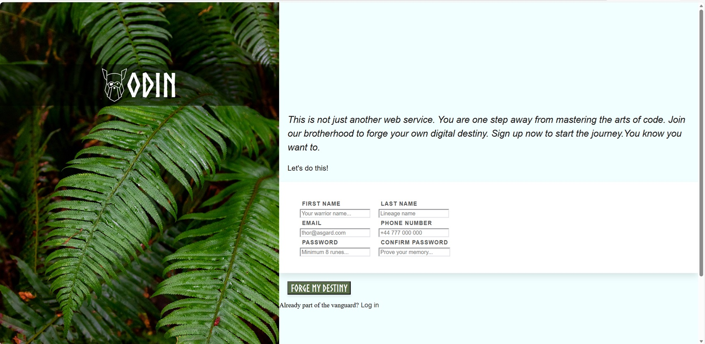

🚀 Features
Custom Brand Typography: Integration of the 'Norse' font for an epic, thematic feel.

Dual-Panel Layout: Built with CSS Grid for a responsive 2:3 ratio split between the brand imagery and the registration form.

Interactive UI: * Premium Hover Effects: Buttons that lift and scale using CSS transform and transition.

Custom Shadowing: Directional box-shadow on the form container for a "floating" depth effect.

Semantic HTML5: Proper use of form labels, input types (tel, email, password), and sectioning.

Modern CSS Properties: Use of object-fit: cover for high-quality background handling and box-sizing: border-box for precise layout control.

🛠️ Built With
HTML5: Semantic structure.

CSS3: Grid, Flexbox, Pseudo-classes (:hover), and Custom Properties.

Typography: 'Norse' (Viking theme) & 'Inter' (UI legibility).

.

### 📱 Responsive Design
- Implemented **Media Queries** to ensure a seamless experience across desktop and tablet/mobile devices.
- Refactored the main container from `grid` to `flex-direction: column` for smaller screens.

--Last changes 23/02/2026 --

### 🎨 Advanced UI & UX
- **Smart Validation:** Integrated the `:user-invalid` pseudo-class to prevent "aggressive" red borders on page load, providing feedback only after user interaction.
- **Micro-interactions:** Added smooth `transition` and `transform` effects on `input:focus` to enhance the form's tactile feel.
- **Typography:** Used custom 'Norse' and 'Inter' fonts with optimized `letter-spacing` for a premium look.

### 🛠️ Technical Challenges Overcome
- Resolved **CSS Cascade** issues where media query styles were conflicting with global styles.
- Fixed browser-specific **autofill** and **outline** inconsistencies in input fields.